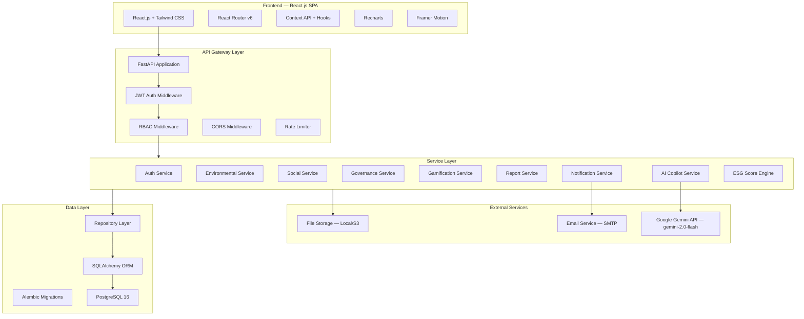
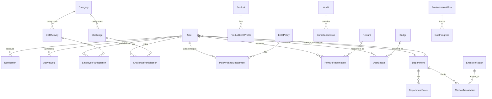

# EcoSync — Implementation Plan
### AI-Powered ESG Management Platform

> [!NOTE]
> This plan is based on analysis of both the **AGENTS.md** specification and the **official EcoSphere ESG Management Platform** problem statement PDF. All mandatory features from the problem statement are included. AI enhancements are layered on top as the main differentiator.

---

## 1. System Architecture



### Architecture Principles
- **Clean Architecture** — Dependencies point inward (API → Service → Repository → Database)
- **Service + Repository Pattern** — Business logic in services, data access in repositories
- **Single User Table + RBAC** — One login, one JWT, role-based access everywhere
- **Modular Monolith** — Organized by domain modules, easily extractable to microservices later

---

## 2. Database Schema

### 2.1 ER Diagram



### 2.2 Full Table Definitions

#### Core / Auth Tables

**`users`**
| Column | Type | Constraints | Description |
|--------|------|-------------|-------------|
| id | UUID | PK | Primary key |
| email | VARCHAR(255) | UNIQUE, NOT NULL | Login email |
| password_hash | VARCHAR(255) | NOT NULL | Bcrypt hashed password |
| first_name | VARCHAR(100) | NOT NULL | |
| last_name | VARCHAR(100) | NOT NULL | |
| role | ENUM | NOT NULL | admin, esg_manager, department_head, employee, auditor |
| department_id | UUID | FK → departments.id, NULLABLE | |
| avatar_url | VARCHAR(500) | NULLABLE | |
| xp_points | INTEGER | DEFAULT 0 | Gamification XP balance |
| is_active | BOOLEAN | DEFAULT true | |
| last_login | TIMESTAMP | NULLABLE | |
| created_at | TIMESTAMP | DEFAULT NOW() | |
| updated_at | TIMESTAMP | DEFAULT NOW() | |

**`departments`**
| Column | Type | Constraints | Description |
|--------|------|-------------|-------------|
| id | UUID | PK | |
| name | VARCHAR(100) | UNIQUE, NOT NULL | |
| code | VARCHAR(20) | UNIQUE, NOT NULL | |
| head_id | UUID | FK → users.id, NULLABLE | Department head |
| parent_department_id | UUID | FK → departments.id, NULLABLE | Hierarchy |
| employee_count | INTEGER | DEFAULT 0 | Cached count |
| status | ENUM | DEFAULT 'active' | active, inactive |
| created_at | TIMESTAMP | DEFAULT NOW() | |
| updated_at | TIMESTAMP | DEFAULT NOW() | |

**`categories`**
| Column | Type | Constraints | Description |
|--------|------|-------------|-------------|
| id | UUID | PK | |
| name | VARCHAR(100) | NOT NULL | |
| type | ENUM | NOT NULL | csr_activity, challenge |
| description | TEXT | NULLABLE | |
| status | ENUM | DEFAULT 'active' | active, inactive |
| created_at | TIMESTAMP | DEFAULT NOW() | |

---

#### Environmental Module

**`emission_factors`**
| Column | Type | Constraints | Description |
|--------|------|-------------|-------------|
| id | UUID | PK | |
| name | VARCHAR(200) | NOT NULL | |
| category | VARCHAR(100) | NOT NULL | e.g., Fuel, Electricity, Transport |
| unit | VARCHAR(50) | NOT NULL | e.g., kg CO₂/kWh |
| factor_value | DECIMAL(12,6) | NOT NULL | Emission factor value |
| scope | ENUM | NOT NULL | scope_1, scope_2, scope_3 |
| source | VARCHAR(200) | NULLABLE | e.g., EPA, DEFRA |
| valid_from | DATE | NULLABLE | |
| valid_to | DATE | NULLABLE | |
| status | ENUM | DEFAULT 'active' | |
| created_at | TIMESTAMP | DEFAULT NOW() | |

**`carbon_transactions`**
| Column | Type | Constraints | Description |
|--------|------|-------------|-------------|
| id | UUID | PK | |
| department_id | UUID | FK → departments.id | |
| emission_factor_id | UUID | FK → emission_factors.id | |
| source_type | ENUM | NOT NULL | purchase, manufacturing, expense, fleet, manual |
| source_reference | VARCHAR(200) | NULLABLE | ERP record reference |
| quantity | DECIMAL(12,4) | NOT NULL | Amount consumed |
| unit | VARCHAR(50) | NOT NULL | |
| calculated_emission | DECIMAL(12,4) | NOT NULL | quantity × factor_value |
| transaction_date | DATE | NOT NULL | |
| description | TEXT | NULLABLE | |
| is_auto_calculated | BOOLEAN | DEFAULT false | |
| created_by | UUID | FK → users.id | |
| created_at | TIMESTAMP | DEFAULT NOW() | |

**`products`**
| Column | Type | Constraints | Description |
|--------|------|-------------|-------------|
| id | UUID | PK | |
| name | VARCHAR(200) | NOT NULL | |
| sku | VARCHAR(50) | UNIQUE | |
| department_id | UUID | FK → departments.id, NULLABLE | |
| status | ENUM | DEFAULT 'active' | |
| created_at | TIMESTAMP | DEFAULT NOW() | |

**`product_esg_profiles`**
| Column | Type | Constraints | Description |
|--------|------|-------------|-------------|
| id | UUID | PK | |
| product_id | UUID | FK → products.id, UNIQUE | |
| carbon_footprint | DECIMAL(12,4) | NULLABLE | kg CO₂ |
| recyclability_score | DECIMAL(5,2) | NULLABLE | 0–100 |
| sustainability_rating | ENUM | NULLABLE | A, B, C, D, F |
| notes | TEXT | NULLABLE | |
| updated_at | TIMESTAMP | DEFAULT NOW() | |

**`environmental_goals`**
| Column | Type | Constraints | Description |
|--------|------|-------------|-------------|
| id | UUID | PK | |
| title | VARCHAR(200) | NOT NULL | |
| description | TEXT | NULLABLE | |
| target_value | DECIMAL(12,4) | NOT NULL | Target emission reduction |
| current_value | DECIMAL(12,4) | DEFAULT 0 | |
| unit | VARCHAR(50) | NOT NULL | |
| department_id | UUID | FK → departments.id, NULLABLE | Null = org-wide |
| start_date | DATE | NOT NULL | |
| end_date | DATE | NOT NULL | |
| status | ENUM | DEFAULT 'active' | active, completed, missed |
| created_by | UUID | FK → users.id | |
| created_at | TIMESTAMP | DEFAULT NOW() | |

**`goal_progress`**
| Column | Type | Constraints | Description |
|--------|------|-------------|-------------|
| id | UUID | PK | |
| goal_id | UUID | FK → environmental_goals.id | |
| recorded_value | DECIMAL(12,4) | NOT NULL | |
| recorded_date | DATE | NOT NULL | |
| notes | TEXT | NULLABLE | |
| created_at | TIMESTAMP | DEFAULT NOW() | |

---

#### Social Module

**`csr_activities`**
| Column | Type | Constraints | Description |
|--------|------|-------------|-------------|
| id | UUID | PK | |
| title | VARCHAR(200) | NOT NULL | |
| description | TEXT | NOT NULL | |
| category_id | UUID | FK → categories.id | |
| department_id | UUID | FK → departments.id, NULLABLE | |
| start_date | DATE | NOT NULL | |
| end_date | DATE | NOT NULL | |
| max_participants | INTEGER | NULLABLE | |
| points_awarded | INTEGER | DEFAULT 0 | Points for participation |
| evidence_required | BOOLEAN | DEFAULT false | |
| status | ENUM | DEFAULT 'draft' | draft, active, completed, cancelled |
| created_by | UUID | FK → users.id | |
| created_at | TIMESTAMP | DEFAULT NOW() | |

**`employee_participation`**
| Column | Type | Constraints | Description |
|--------|------|-------------|-------------|
| id | UUID | PK | |
| employee_id | UUID | FK → users.id | |
| activity_id | UUID | FK → csr_activities.id | |
| proof_url | VARCHAR(500) | NULLABLE | Evidence file URL |
| approval_status | ENUM | DEFAULT 'pending' | pending, approved, rejected |
| approved_by | UUID | FK → users.id, NULLABLE | |
| points_earned | INTEGER | DEFAULT 0 | |
| completion_date | DATE | NULLABLE | |
| notes | TEXT | NULLABLE | |
| created_at | TIMESTAMP | DEFAULT NOW() | |

**`diversity_metrics`**
| Column | Type | Constraints | Description |
|--------|------|-------------|-------------|
| id | UUID | PK | |
| department_id | UUID | FK → departments.id | |
| metric_type | VARCHAR(100) | NOT NULL | gender, ethnicity, age_group, etc. |
| metric_value | VARCHAR(100) | NOT NULL | |
| count | INTEGER | NOT NULL | |
| period | DATE | NOT NULL | Reporting month |
| created_at | TIMESTAMP | DEFAULT NOW() | |

**`trainings`**
| Column | Type | Constraints | Description |
|--------|------|-------------|-------------|
| id | UUID | PK | |
| title | VARCHAR(200) | NOT NULL | |
| description | TEXT | NULLABLE | |
| department_id | UUID | FK → departments.id, NULLABLE | |
| completion_rate | DECIMAL(5,2) | DEFAULT 0 | Percentage |
| due_date | DATE | NULLABLE | |
| status | ENUM | DEFAULT 'active' | |
| created_at | TIMESTAMP | DEFAULT NOW() | |

---

#### Governance Module

**`esg_policies`**
| Column | Type | Constraints | Description |
|--------|------|-------------|-------------|
| id | UUID | PK | |
| title | VARCHAR(200) | NOT NULL | |
| description | TEXT | NOT NULL | |
| content | TEXT | NOT NULL | Full policy text |
| version | VARCHAR(20) | DEFAULT '1.0' | |
| effective_date | DATE | NOT NULL | |
| review_date | DATE | NULLABLE | |
| status | ENUM | DEFAULT 'draft' | draft, active, archived |
| created_by | UUID | FK → users.id | |
| created_at | TIMESTAMP | DEFAULT NOW() | |

**`policy_acknowledgements`**
| Column | Type | Constraints | Description |
|--------|------|-------------|-------------|
| id | UUID | PK | |
| policy_id | UUID | FK → esg_policies.id | |
| employee_id | UUID | FK → users.id | |
| acknowledged_at | TIMESTAMP | NOT NULL | |
| ip_address | VARCHAR(45) | NULLABLE | |
| created_at | TIMESTAMP | DEFAULT NOW() | |

**`audits`**
| Column | Type | Constraints | Description |
|--------|------|-------------|-------------|
| id | UUID | PK | |
| title | VARCHAR(200) | NOT NULL | |
| description | TEXT | NULLABLE | |
| department_id | UUID | FK → departments.id | |
| auditor_id | UUID | FK → users.id | |
| audit_date | DATE | NOT NULL | |
| findings | TEXT | NULLABLE | |
| status | ENUM | DEFAULT 'planned' | planned, in_progress, completed, closed |
| score | DECIMAL(5,2) | NULLABLE | Audit score 0-100 |
| created_at | TIMESTAMP | DEFAULT NOW() | |

**`compliance_issues`**
| Column | Type | Constraints | Description |
|--------|------|-------------|-------------|
| id | UUID | PK | |
| audit_id | UUID | FK → audits.id | |
| title | VARCHAR(200) | NOT NULL | |
| description | TEXT | NOT NULL | |
| severity | ENUM | NOT NULL | low, medium, high, critical |
| owner_id | UUID | FK → users.id, NOT NULL | **Mandatory per problem statement** |
| due_date | DATE | NOT NULL | **Mandatory per problem statement** |
| status | ENUM | DEFAULT 'open' | open, in_progress, resolved, overdue |
| resolution | TEXT | NULLABLE | |
| resolved_at | TIMESTAMP | NULLABLE | |
| created_by | UUID | FK → users.id | |
| created_at | TIMESTAMP | DEFAULT NOW() | |

---

#### Gamification Module

**`challenges`**
| Column | Type | Constraints | Description |
|--------|------|-------------|-------------|
| id | UUID | PK | |
| title | VARCHAR(200) | NOT NULL | |
| description | TEXT | NOT NULL | |
| category_id | UUID | FK → categories.id | |
| xp_reward | INTEGER | NOT NULL | XP awarded on completion |
| difficulty | ENUM | NOT NULL | easy, medium, hard, expert |
| evidence_required | BOOLEAN | DEFAULT false | |
| deadline | DATE | NULLABLE | |
| max_participants | INTEGER | NULLABLE | |
| status | ENUM | DEFAULT 'draft' | draft, active, under_review, completed, archived |
| created_by | UUID | FK → users.id | |
| created_at | TIMESTAMP | DEFAULT NOW() | |

**`challenge_participation`**
| Column | Type | Constraints | Description |
|--------|------|-------------|-------------|
| id | UUID | PK | |
| challenge_id | UUID | FK → challenges.id | |
| employee_id | UUID | FK → users.id | |
| progress | DECIMAL(5,2) | DEFAULT 0 | 0-100% |
| proof_url | VARCHAR(500) | NULLABLE | |
| approval_status | ENUM | DEFAULT 'pending' | pending, approved, rejected |
| approved_by | UUID | FK → users.id, NULLABLE | |
| xp_awarded | INTEGER | DEFAULT 0 | |
| completed_at | TIMESTAMP | NULLABLE | |
| created_at | TIMESTAMP | DEFAULT NOW() | |

**`badges`**
| Column | Type | Constraints | Description |
|--------|------|-------------|-------------|
| id | UUID | PK | |
| name | VARCHAR(100) | NOT NULL | |
| description | TEXT | NULLABLE | |
| icon | VARCHAR(200) | NOT NULL | Icon name or URL |
| unlock_rule_type | ENUM | NOT NULL | xp_threshold, challenge_count, custom |
| unlock_rule_value | INTEGER | NOT NULL | Threshold value |
| status | ENUM | DEFAULT 'active' | |
| created_at | TIMESTAMP | DEFAULT NOW() | |

**`user_badges`**
| Column | Type | Constraints | Description |
|--------|------|-------------|-------------|
| id | UUID | PK | |
| user_id | UUID | FK → users.id | |
| badge_id | UUID | FK → badges.id | |
| awarded_at | TIMESTAMP | DEFAULT NOW() | |
| UNIQUE | | (user_id, badge_id) | No duplicates |

**`rewards`**
| Column | Type | Constraints | Description |
|--------|------|-------------|-------------|
| id | UUID | PK | |
| name | VARCHAR(200) | NOT NULL | |
| description | TEXT | NULLABLE | |
| points_required | INTEGER | NOT NULL | XP cost |
| stock | INTEGER | DEFAULT 0 | Available quantity |
| image_url | VARCHAR(500) | NULLABLE | |
| status | ENUM | DEFAULT 'active' | active, inactive |
| created_at | TIMESTAMP | DEFAULT NOW() | |

**`reward_redemptions`**
| Column | Type | Constraints | Description |
|--------|------|-------------|-------------|
| id | UUID | PK | |
| reward_id | UUID | FK → rewards.id | |
| employee_id | UUID | FK → users.id | |
| points_spent | INTEGER | NOT NULL | |
| status | ENUM | DEFAULT 'pending' | pending, fulfilled, cancelled |
| redeemed_at | TIMESTAMP | DEFAULT NOW() | |

---

#### Scoring

**`department_scores`**
| Column | Type | Constraints | Description |
|--------|------|-------------|-------------|
| id | UUID | PK | |
| department_id | UUID | FK → departments.id | |
| environmental_score | DECIMAL(5,2) | DEFAULT 0 | |
| social_score | DECIMAL(5,2) | DEFAULT 0 | |
| governance_score | DECIMAL(5,2) | DEFAULT 0 | |
| total_score | DECIMAL(5,2) | DEFAULT 0 | Weighted composite |
| period | DATE | NOT NULL | Scoring period |
| calculated_at | TIMESTAMP | DEFAULT NOW() | |

**`esg_configuration`**
| Column | Type | Constraints | Description |
|--------|------|-------------|-------------|
| id | UUID | PK | |
| key | VARCHAR(100) | UNIQUE, NOT NULL | |
| value | TEXT | NOT NULL | |
| description | TEXT | NULLABLE | |
| updated_by | UUID | FK → users.id | |
| updated_at | TIMESTAMP | DEFAULT NOW() | |

Default configs: `env_weight=40`, `social_weight=30`, `gov_weight=30`, `auto_emission=true`, `evidence_required=true`, `badge_auto_award=true`

---

#### System

**`notifications`**
| Column | Type | Constraints | Description |
|--------|------|-------------|-------------|
| id | UUID | PK | |
| user_id | UUID | FK → users.id | |
| title | VARCHAR(200) | NOT NULL | |
| message | TEXT | NOT NULL | |
| type | ENUM | NOT NULL | compliance_issue, csr_approval, badge_unlock, policy_reminder, challenge_update, system |
| is_read | BOOLEAN | DEFAULT false | |
| link | VARCHAR(500) | NULLABLE | Deep link |
| created_at | TIMESTAMP | DEFAULT NOW() | |

**`activity_logs`**
| Column | Type | Constraints | Description |
|--------|------|-------------|-------------|
| id | UUID | PK | |
| user_id | UUID | FK → users.id | |
| action | VARCHAR(100) | NOT NULL | |
| entity_type | VARCHAR(100) | NOT NULL | |
| entity_id | UUID | NULLABLE | |
| details | JSONB | NULLABLE | |
| ip_address | VARCHAR(45) | NULLABLE | |
| created_at | TIMESTAMP | DEFAULT NOW() | |

**`ai_conversations`**
| Column | Type | Constraints | Description |
|--------|------|-------------|-------------|
| id | UUID | PK | |
| user_id | UUID | FK → users.id | |
| title | VARCHAR(200) | NULLABLE | |
| created_at | TIMESTAMP | DEFAULT NOW() | |
| updated_at | TIMESTAMP | DEFAULT NOW() | |

**`ai_messages`**
| Column | Type | Constraints | Description |
|--------|------|-------------|-------------|
| id | UUID | PK | |
| conversation_id | UUID | FK → ai_conversations.id | |
| role | ENUM | NOT NULL | user, assistant |
| content | TEXT | NOT NULL | |
| created_at | TIMESTAMP | DEFAULT NOW() | |

---

## 3. Folder Structure

> [!TIP]
> **Consolidation strategy**: Backend files are grouped by **domain module** (environmental, social, governance, gamification) instead of one file per entity. Frontend components are merged into fewer, reusable files. This reduces the project from **~170 files → ~75 files** while keeping clean separation.

```
EcoSync/
├── frontend/
│   ├── public/
│   │   └── favicon.ico
│   ├── src/
│   │   ├── components/
│   │   │   ├── ui/                        ← All reusable UI primitives in one folder
│   │   │   │   ├── FormControls.jsx       (Button, Input, Select, FileUpload, SearchBar)
│   │   │   │   ├── DataDisplay.jsx        (Table, Card, Badge, StatusBadge, Pagination, EmptyState)
│   │   │   │   ├── Overlays.jsx           (Modal, Toast, Loader, FilterPanel)
│   │   │   │   └── Charts.jsx             (ESGScoreGauge, EmissionsChart, TrendChart, DeptRanking, PieBreakdown)
│   │   │   ├── layout/                    ← Navigation + layout merged
│   │   │   │   ├── Sidebar.jsx            (Sidebar + role-adaptive nav)
│   │   │   │   └── Topbar.jsx             (Topbar + Breadcrumb + UserMenu + NotifBell)
│   │   │   └── ai/
│   │   │       └── ChatUI.jsx             (ChatWindow + MessageBubble + ConversationList + PromptSuggestions)
│   │   ├── pages/
│   │   │   ├── LoginPage.jsx              (Auth: login + demo account selector)
│   │   │   ├── DashboardPage.jsx          (Renders Admin/Manager/DeptHead/Employee view based on role)
│   │   │   ├── EnvironmentalPage.jsx      (Emission Factors, Carbon Transactions, Goals, Products — tab-based)
│   │   │   ├── SocialPage.jsx             (CSR Activities, Participation, Diversity, Training — tab-based)
│   │   │   ├── GovernancePage.jsx         (Policies, Audits, Compliance Issues — tab-based)
│   │   │   ├── GamificationPage.jsx       (Challenges, Badges, Rewards, Leaderboard — tab-based)
│   │   │   ├── ReportsPage.jsx            (Report selector, viewer, custom builder, exports)
│   │   │   ├── AICopilotPage.jsx          (Chat interface with conversation history)
│   │   │   ├── AdminPage.jsx              (Users, Departments, Categories, Settings — tab-based)
│   │   │   └── NotFoundPage.jsx
│   │   ├── layouts/
│   │   │   ├── MainLayout.jsx             (Sidebar + Topbar + Content)
│   │   │   └── AuthLayout.jsx             (Centered card for login)
│   │   ├── hooks/
│   │   │   ├── useAuth.js
│   │   │   ├── useApi.js                  (useApi + useDebounce + usePagination merged)
│   │   │   ├── useTheme.js
│   │   │   └── useNotifications.js
│   │   ├── services/
│   │   │   ├── api.js                     (Axios instance + interceptors)
│   │   │   ├── authService.js
│   │   │   ├── esgService.js              (Environmental + Social + Governance API calls)
│   │   │   ├── gamificationService.js     (Challenges, Badges, Rewards, Leaderboard)
│   │   │   ├── dashboardService.js        (Dashboard + Reports + Notifications)
│   │   │   └── aiService.js
│   │   ├── context/
│   │   │   └── AppContext.jsx             (Auth + Theme + Notifications in one provider)
│   │   ├── routes/
│   │   │   └── AppRouter.jsx              (Router + ProtectedRoute + route config)
│   │   ├── utils/
│   │   │   └── helpers.js                 (constants + formatters + validators + rolePermissions)
│   │   ├── index.css                      (Tailwind directives + custom styles)
│   │   ├── App.jsx
│   │   └── main.jsx
│   ├── tailwind.config.js
│   ├── postcss.config.js
│   ├── vite.config.js
│   ├── package.json
│   └── .env
│
├── backend/
│   ├── app/
│   │   ├── __init__.py
│   │   ├── main.py                        (FastAPI app factory)
│   │   ├── api/
│   │   │   ├── __init__.py
│   │   │   ├── deps.py                    (Dependency injection: get_db, get_current_user, role checks)
│   │   │   ├── auth.py                    (Login, refresh, me, change-password)
│   │   │   ├── admin.py                   (Users CRUD, Departments, Categories, Settings)
│   │   │   ├── environmental.py           (Emission Factors, Carbon Transactions, Products, Goals)
│   │   │   ├── social.py                  (CSR Activities, Participation, Diversity, Training)
│   │   │   ├── governance.py              (Policies, Acknowledgements, Audits, Compliance Issues)
│   │   │   ├── gamification.py            (Challenges, Participation, Badges, Rewards, Leaderboard)
│   │   │   ├── dashboard.py               (Dashboard endpoints for all roles)
│   │   │   ├── reports.py                 (Report generation + export)
│   │   │   ├── notifications.py           (List, read, unread-count)
│   │   │   ├── ai_copilot.py              (Chat, conversations, AI reports)
│   │   │   └── upload.py                  (File upload endpoint)
│   │   ├── models/
│   │   │   ├── __init__.py                (Import all models for Alembic discovery)
│   │   │   ├── base.py                    (Base model: UUID pk, created_at, updated_at)
│   │   │   ├── core.py                    (User, Department, Category, ESGConfiguration, Notification, ActivityLog)
│   │   │   ├── environmental.py           (EmissionFactor, CarbonTransaction, Product, ProductESGProfile, EnvironmentalGoal, GoalProgress)
│   │   │   ├── social.py                  (CSRActivity, EmployeeParticipation, DiversityMetric, Training)
│   │   │   ├── governance.py              (ESGPolicy, PolicyAcknowledgement, Audit, ComplianceIssue)
│   │   │   ├── gamification.py            (Challenge, ChallengeParticipation, Badge, UserBadge, Reward, RewardRedemption)
│   │   │   └── scoring.py                 (DepartmentScore)
│   │   ├── schemas/
│   │   │   ├── __init__.py
│   │   │   ├── common.py                  (PaginatedResponse, FilterParams, MessageResponse)
│   │   │   ├── auth.py                    (LoginRequest, TokenResponse, ChangePassword)
│   │   │   ├── core.py                    (UserCreate/Update/Response, DepartmentSchema, CategorySchema, NotificationSchema)
│   │   │   ├── environmental.py           (EmissionFactor, CarbonTransaction, Product, Goal schemas)
│   │   │   ├── social.py                  (CSRActivity, Participation, DiversityMetric, Training schemas)
│   │   │   ├── governance.py              (Policy, Audit, ComplianceIssue schemas)
│   │   │   ├── gamification.py            (Challenge, Badge, Reward, Leaderboard schemas)
│   │   │   ├── dashboard.py               (DashboardOverview, ScoreCard, ChartData)
│   │   │   └── ai.py                      (ChatMessage, ConversationSchema)
│   │   ├── services/
│   │   │   ├── __init__.py
│   │   │   ├── auth_service.py            (Login, JWT, password hashing)
│   │   │   ├── admin_service.py           (Users, Departments, Categories, Settings)
│   │   │   ├── environmental_service.py   (Emissions, Carbon, Products, Goals + auto-calculation)
│   │   │   ├── social_service.py          (CSR, Participation, Diversity, Training + evidence check)
│   │   │   ├── governance_service.py      (Policies, Audits, Compliance + overdue flagging)
│   │   │   ├── gamification_service.py    (Challenges, Badges auto-award, Rewards redemption, XP, Leaderboard)
│   │   │   ├── score_service.py           (Department + Overall ESG score engine)
│   │   │   ├── dashboard_service.py       (Dashboard aggregation for all roles)
│   │   │   ├── report_service.py          (Report generation + CSV/Excel/PDF export)
│   │   │   ├── notification_service.py    (In-app + email notifications)
│   │   │   └── ai_service.py              (Gemini API integration, RAG, prompts)
│   │   ├── repositories/
│   │   │   ├── __init__.py
│   │   │   ├── base.py                    (Generic CRUD: create, get, list, update, delete, paginate)
│   │   │   ├── core_repo.py               (UserRepo, DepartmentRepo, CategoryRepo, NotificationRepo)
│   │   │   ├── environmental_repo.py      (EmissionFactorRepo, CarbonTransactionRepo, ProductRepo, GoalRepo)
│   │   │   ├── social_repo.py             (CSRActivityRepo, ParticipationRepo)
│   │   │   ├── governance_repo.py         (PolicyRepo, AuditRepo, ComplianceIssueRepo)
│   │   │   └── gamification_repo.py       (ChallengeRepo, BadgeRepo, RewardRepo, ScoreRepo)
│   │   ├── database/
│   │   │   ├── __init__.py
│   │   │   ├── session.py                 (Async engine + session factory)
│   │   │   └── seed.py                    (Demo data seeder for all 5 roles)
│   │   ├── core/
│   │   │   ├── __init__.py
│   │   │   ├── config.py                  (Pydantic Settings from .env)
│   │   │   ├── security.py                (JWT encode/decode, bcrypt hashing, RBAC decorators)
│   │   │   └── exceptions.py              (Custom HTTP exceptions)
│   │   ├── middleware/
│   │   │   ├── __init__.py
│   │   │   └── middleware.py              (Auth + RBAC + Request logging — combined)
│   │   └── utils/
│   │       ├── __init__.py
│   │       └── helpers.py                 (Pagination, file handler, email sender)
│   ├── alembic/
│   │   ├── env.py
│   │   ├── alembic.ini
│   │   └── versions/
│   ├── requirements.txt
│   ├── Dockerfile
│   └── .env
│
├── docker-compose.yml
├── .gitignore
├── README.md
└── AGENTS.md
```

### File Count Summary

| Layer | Before | After | Strategy |
|-------|--------|-------|----------|
| **Frontend Components** | 29 files | 7 files | Merged by function (form controls, data display, overlays, charts) |
| **Frontend Pages** | 32 files | 10 files | One page per module with tab-based sub-navigation |
| **Frontend Hooks** | 6 files | 4 files | Merged API + pagination + debounce |
| **Frontend Services** | 10 files | 6 files | Merged ESG modules into one service |
| **Frontend Context** | 3 files | 1 file | Single AppContext provider |
| **Frontend Routes** | 3 files | 1 file | All routing in one file |
| **Frontend Utils** | 4 files | 1 file | Single helpers file |
| **Backend API Routes** | 26 files | 13 files | Grouped by domain module |
| **Backend Models** | 24 files | 8 files | Grouped by domain module |
| **Backend Schemas** | 22 files | 10 files | Grouped by domain module |
| **Backend Services** | 20 files | 11 files | Grouped by domain module |
| **Backend Repositories** | 16 files | 7 files | Grouped by domain module |
| **Backend Middleware** | 4 files | 2 files | Combined into one file |
| **Backend Utils** | 4 files | 2 files | Combined into one file |
| **Total** | **~170** | **~75** | **56% reduction** |

---

## 4. API Endpoints

### Auth
| Method | Endpoint | Description | Roles |
|--------|----------|-------------|-------|
| POST | `/api/v1/auth/login` | Login, returns JWT | Public |
| POST | `/api/v1/auth/refresh` | Refresh token | Authenticated |
| GET | `/api/v1/auth/me` | Current user profile | Authenticated |
| PUT | `/api/v1/auth/me` | Update own profile | Authenticated |
| POST | `/api/v1/auth/change-password` | Change password | Authenticated |

### Users (Admin)
| Method | Endpoint | Description | Roles |
|--------|----------|-------------|-------|
| GET | `/api/v1/users` | List users (paginated, searchable) | Admin |
| POST | `/api/v1/users` | Create user | Admin |
| GET | `/api/v1/users/{id}` | Get user detail | Admin |
| PUT | `/api/v1/users/{id}` | Update user | Admin |
| DELETE | `/api/v1/users/{id}` | Deactivate user | Admin |

### Departments
| Method | Endpoint | Description | Roles |
|--------|----------|-------------|-------|
| GET | `/api/v1/departments` | List departments | All |
| POST | `/api/v1/departments` | Create department | Admin |
| GET | `/api/v1/departments/{id}` | Get department | All |
| PUT | `/api/v1/departments/{id}` | Update department | Admin |
| DELETE | `/api/v1/departments/{id}` | Deactivate department | Admin |
| GET | `/api/v1/departments/{id}/score` | Department ESG score | Admin, Manager, DeptHead |
| GET | `/api/v1/departments/{id}/employees` | Department employees | Admin, Manager, DeptHead |

### Categories
| Method | Endpoint | Description | Roles |
|--------|----------|-------------|-------|
| GET | `/api/v1/categories` | List categories | All |
| POST | `/api/v1/categories` | Create category | Admin |
| PUT | `/api/v1/categories/{id}` | Update category | Admin |
| DELETE | `/api/v1/categories/{id}` | Deactivate category | Admin |

### Emission Factors
| Method | Endpoint | Description | Roles |
|--------|----------|-------------|-------|
| GET | `/api/v1/emission-factors` | List emission factors | Admin, Manager |
| POST | `/api/v1/emission-factors` | Create emission factor | Admin |
| PUT | `/api/v1/emission-factors/{id}` | Update emission factor | Admin |
| DELETE | `/api/v1/emission-factors/{id}` | Deactivate emission factor | Admin |

### Carbon Transactions
| Method | Endpoint | Description | Roles |
|--------|----------|-------------|-------|
| GET | `/api/v1/carbon-transactions` | List transactions (filterable) | Admin, Manager, DeptHead |
| POST | `/api/v1/carbon-transactions` | Create transaction | Admin, Manager |
| GET | `/api/v1/carbon-transactions/{id}` | Get transaction | Admin, Manager, DeptHead |
| PUT | `/api/v1/carbon-transactions/{id}` | Update transaction | Admin, Manager |
| DELETE | `/api/v1/carbon-transactions/{id}` | Delete transaction | Admin |
| GET | `/api/v1/carbon-transactions/summary` | Aggregated emissions summary | Admin, Manager, DeptHead |

### Products & ESG Profiles
| Method | Endpoint | Description | Roles |
|--------|----------|-------------|-------|
| GET | `/api/v1/products` | List products | Admin, Manager |
| POST | `/api/v1/products` | Create product | Admin |
| PUT | `/api/v1/products/{id}` | Update product | Admin |
| GET | `/api/v1/products/{id}/esg-profile` | Get ESG profile | Admin, Manager |
| PUT | `/api/v1/products/{id}/esg-profile` | Update ESG profile | Admin, Manager |

### Environmental Goals
| Method | Endpoint | Description | Roles |
|--------|----------|-------------|-------|
| GET | `/api/v1/environmental-goals` | List goals | Admin, Manager, DeptHead |
| POST | `/api/v1/environmental-goals` | Create goal | Admin, Manager |
| GET | `/api/v1/environmental-goals/{id}` | Get goal | Admin, Manager, DeptHead |
| PUT | `/api/v1/environmental-goals/{id}` | Update goal | Admin, Manager |
| POST | `/api/v1/environmental-goals/{id}/progress` | Record progress | Admin, Manager |

### CSR Activities
| Method | Endpoint | Description | Roles |
|--------|----------|-------------|-------|
| GET | `/api/v1/csr-activities` | List activities | All |
| POST | `/api/v1/csr-activities` | Create activity | Admin, Manager |
| GET | `/api/v1/csr-activities/{id}` | Get activity | All |
| PUT | `/api/v1/csr-activities/{id}` | Update activity | Admin, Manager |
| DELETE | `/api/v1/csr-activities/{id}` | Cancel activity | Admin, Manager |

### Employee Participation (CSR)
| Method | Endpoint | Description | Roles |
|--------|----------|-------------|-------|
| GET | `/api/v1/participations` | List participations | Admin, Manager, DeptHead |
| POST | `/api/v1/participations` | Join activity | Employee |
| GET | `/api/v1/participations/{id}` | Get participation | All |
| PUT | `/api/v1/participations/{id}/approve` | Approve/reject | Admin, Manager, DeptHead |
| POST | `/api/v1/participations/{id}/evidence` | Upload evidence | Employee |
| GET | `/api/v1/participations/my` | My participations | Employee |

### ESG Policies
| Method | Endpoint | Description | Roles |
|--------|----------|-------------|-------|
| GET | `/api/v1/policies` | List policies | All |
| POST | `/api/v1/policies` | Create policy | Admin, Manager |
| GET | `/api/v1/policies/{id}` | Get policy | All |
| PUT | `/api/v1/policies/{id}` | Update policy | Admin, Manager |
| POST | `/api/v1/policies/{id}/acknowledge` | Acknowledge policy | Employee |
| GET | `/api/v1/policies/{id}/acknowledgements` | List acknowledgements | Admin, Manager |

### Audits
| Method | Endpoint | Description | Roles |
|--------|----------|-------------|-------|
| GET | `/api/v1/audits` | List audits | Admin, Manager, Auditor |
| POST | `/api/v1/audits` | Create audit | Auditor |
| GET | `/api/v1/audits/{id}` | Get audit | Admin, Manager, Auditor |
| PUT | `/api/v1/audits/{id}` | Update audit | Auditor |
| PUT | `/api/v1/audits/{id}/close` | Close audit | Auditor |

### Compliance Issues
| Method | Endpoint | Description | Roles |
|--------|----------|-------------|-------|
| GET | `/api/v1/compliance-issues` | List issues | Admin, Manager, Auditor |
| POST | `/api/v1/compliance-issues` | Raise issue | Auditor |
| GET | `/api/v1/compliance-issues/{id}` | Get issue | Admin, Manager, Auditor |
| PUT | `/api/v1/compliance-issues/{id}` | Update issue | Auditor |
| PUT | `/api/v1/compliance-issues/{id}/resolve` | Resolve issue | Auditor |

### Challenges
| Method | Endpoint | Description | Roles |
|--------|----------|-------------|-------|
| GET | `/api/v1/challenges` | List challenges | All |
| POST | `/api/v1/challenges` | Create challenge | Admin, Manager |
| GET | `/api/v1/challenges/{id}` | Get challenge | All |
| PUT | `/api/v1/challenges/{id}` | Update challenge | Admin, Manager |
| PUT | `/api/v1/challenges/{id}/status` | Change lifecycle status | Admin, Manager |

### Challenge Participation
| Method | Endpoint | Description | Roles |
|--------|----------|-------------|-------|
| POST | `/api/v1/challenges/{id}/join` | Join challenge | Employee |
| PUT | `/api/v1/challenge-participations/{id}/progress` | Update progress | Employee |
| POST | `/api/v1/challenge-participations/{id}/evidence` | Upload evidence | Employee |
| PUT | `/api/v1/challenge-participations/{id}/approve` | Approve/reject | Admin, Manager |
| GET | `/api/v1/challenge-participations/my` | My challenge participations | Employee |

### Badges & Rewards
| Method | Endpoint | Description | Roles |
|--------|----------|-------------|-------|
| GET | `/api/v1/badges` | List badges | All |
| POST | `/api/v1/badges` | Create badge | Admin |
| PUT | `/api/v1/badges/{id}` | Update badge | Admin |
| GET | `/api/v1/badges/my` | My earned badges | Employee |
| GET | `/api/v1/rewards` | List rewards | All |
| POST | `/api/v1/rewards` | Create reward | Admin |
| PUT | `/api/v1/rewards/{id}` | Update reward | Admin |
| POST | `/api/v1/rewards/{id}/redeem` | Redeem reward | Employee |
| GET | `/api/v1/rewards/redemptions/my` | My redemptions | Employee |

### Leaderboard
| Method | Endpoint | Description | Roles |
|--------|----------|-------------|-------|
| GET | `/api/v1/leaderboard` | Global XP leaderboard | All |
| GET | `/api/v1/leaderboard/department/{id}` | Department leaderboard | All |

### Dashboard
| Method | Endpoint | Description | Roles |
|--------|----------|-------------|-------|
| GET | `/api/v1/dashboard/overview` | Overall ESG scores | Admin, Manager |
| GET | `/api/v1/dashboard/environmental` | Environmental metrics | Admin, Manager, DeptHead |
| GET | `/api/v1/dashboard/social` | Social metrics | Admin, Manager, DeptHead |
| GET | `/api/v1/dashboard/governance` | Governance metrics | Admin, Manager, DeptHead |
| GET | `/api/v1/dashboard/department/{id}` | Department dashboard | Admin, Manager, DeptHead |
| GET | `/api/v1/dashboard/employee` | Employee personal dashboard | Employee |
| GET | `/api/v1/dashboard/recent-activity` | Recent activity feed | All |

### Reports
| Method | Endpoint | Description | Roles |
|--------|----------|-------------|-------|
| GET | `/api/v1/reports/environmental` | Environmental report | Admin, Manager |
| GET | `/api/v1/reports/social` | Social report | Admin, Manager |
| GET | `/api/v1/reports/governance` | Governance report | Admin, Manager, Auditor |
| GET | `/api/v1/reports/executive-summary` | Executive ESG summary | Admin, Manager |
| POST | `/api/v1/reports/custom` | Custom report builder | Admin, Manager |
| GET | `/api/v1/reports/{id}/export` | Export report (CSV/Excel/PDF) | Admin, Manager |

### Notifications
| Method | Endpoint | Description | Roles |
|--------|----------|-------------|-------|
| GET | `/api/v1/notifications` | List notifications | Authenticated |
| PUT | `/api/v1/notifications/{id}/read` | Mark as read | Authenticated |
| PUT | `/api/v1/notifications/read-all` | Mark all as read | Authenticated |
| GET | `/api/v1/notifications/unread-count` | Unread count | Authenticated |

### Settings
| Method | Endpoint | Description | Roles |
|--------|----------|-------------|-------|
| GET | `/api/v1/settings` | Get all ESG settings | Admin |
| PUT | `/api/v1/settings` | Update settings | Admin |
| GET | `/api/v1/settings/notification` | Notification settings | Admin |
| PUT | `/api/v1/settings/notification` | Update notification settings | Admin |

### AI Copilot
| Method | Endpoint | Description | Roles |
|--------|----------|-------------|-------|
| GET | `/api/v1/ai/conversations` | List conversations | Manager, Employee |
| POST | `/api/v1/ai/conversations` | New conversation | Manager, Employee |
| GET | `/api/v1/ai/conversations/{id}` | Get conversation | Manager, Employee |
| DELETE | `/api/v1/ai/conversations/{id}` | Delete conversation | Manager, Employee |
| POST | `/api/v1/ai/chat` | Send message (streaming) | Manager, Employee |
| POST | `/api/v1/ai/report` | Generate AI ESG report | Manager |
| POST | `/api/v1/ai/recommendations` | Get sustainability recommendations | Manager |

### File Upload
| Method | Endpoint | Description | Roles |
|--------|----------|-------------|-------|
| POST | `/api/v1/upload` | Upload evidence/proof file | Authenticated |

---

## 5. RBAC Permission Matrix

| Feature Area | Admin | ESG Manager | Dept Head | Employee | Auditor |
|-------------|-------|-------------|-----------|----------|---------|
| User Management | ✅ CRUD | ❌ | ❌ | ❌ | ❌ |
| Department Management | ✅ CRUD | 👁️ Read | 👁️ Own dept | ❌ | ❌ |
| Categories | ✅ CRUD | 👁️ Read | 👁️ Read | 👁️ Read | ❌ |
| Emission Factors | ✅ CRUD | ✅ CRUD | 👁️ Read | ❌ | ❌ |
| Carbon Transactions | ✅ CRUD | ✅ CRUD | 👁️ Own dept | ❌ | ❌ |
| Products & ESG | ✅ CRUD | ✅ CRUD | 👁️ Read | ❌ | ❌ |
| Environmental Goals | ✅ CRUD | ✅ CRUD | 👁️ Own dept | ❌ | ❌ |
| CSR Activities | ✅ CRUD | ✅ CRUD | 👁️ Read | 👁️ Read | ❌ |
| Participation (CSR) | ✅ All | ✅ Approve | ✅ Approve own | ✅ Join/Upload | ❌ |
| Diversity Metrics | ✅ CRUD | ✅ CRUD | 👁️ Own dept | ❌ | ❌ |
| ESG Policies | ✅ CRUD | ✅ CRUD | 👁️ Read | 👁️ Acknowledge | ❌ |
| Audits | ✅ All | 👁️ Read | ❌ | ❌ | ✅ CRUD |
| Compliance Issues | ✅ All | 👁️ Read | ❌ | ❌ | ✅ CRUD |
| Challenges | ✅ CRUD | ✅ CRUD | 👁️ Read | 👁️ Join | ❌ |
| Challenge Participation | ✅ All | ✅ Approve | 👁️ Read | ✅ Join/Upload | ❌ |
| Badges | ✅ CRUD | 👁️ Read | 👁️ Read | 👁️ Own | ❌ |
| Rewards | ✅ CRUD | 👁️ Read | 👁️ Read | ✅ Redeem | ❌ |
| Leaderboard | ✅ | ✅ | ✅ | ✅ | ❌ |
| Dashboard | ✅ Org-wide | ✅ Org-wide | ✅ Own dept | ✅ Personal | ❌ |
| Reports | ✅ All | ✅ All | ✅ Own dept | ❌ | ✅ Governance |
| AI Copilot | ✅ | ✅ | ❌ | ✅ | ❌ |
| Settings | ✅ | ❌ | ❌ | ❌ | ❌ |
| Notifications | ✅ Own | ✅ Own | ✅ Own | ✅ Own | ✅ Own |

---

## 6. UI Wireframe Descriptions

### Login Page
- Clean centered card with glassmorphism effect
- EcoSync logo + tagline at top
- Email + Password fields with validation
- "Sign In" button with loading state
- Demo account quick-select dropdown (Admin, ESG Manager, Dept Head, Employee, Auditor)
- Gradient background with subtle leaf/earth animation

### Main Layout
- **Sidebar** (collapsible, 260px): Logo, role-adaptive navigation, user avatar, theme toggle, collapse button
- **Topbar** (64px): Breadcrumb, search bar, notification bell with unread count, user dropdown
- **Content Area**: Responsive grid, max-width container

### Dashboard (Admin/Manager)
- **Row 1**: 4 score cards — Overall ESG Score (radial gauge), Environmental, Social, Governance (each with trend sparkline)
- **Row 2**: Emissions trend chart (area chart) + Department rankings (horizontal bar)
- **Row 3**: CSR participation donut chart + Compliance status breakdown + Leaderboard top 5
- **Row 4**: Recent activity feed (timeline style)

### Dashboard (Employee)
- **Row 1**: Personal XP + Badges earned + Challenges completed + CSR participations
- **Row 2**: Active challenges + Available CSR activities
- **Row 3**: My badges collection + Reward catalog highlights

### Module Pages (e.g., Emission Factors, CSR Activities, Policies)
- Premium data table with: search, column sorting, pagination, status badges, action dropdowns
- Filter panel (expandable): date range, department, status, category
- Create/Edit forms in slide-over panels or modals
- Bulk actions toolbar

### AI Copilot Page
- ChatGPT-style interface
- Left panel: Conversation history list with timestamps
- Main area: Chat messages with markdown rendering, code blocks, charts
- Bottom: Input area with prompt suggestions carousel, send button
- Quick action buttons: "Generate ESG Report", "Carbon Reduction Ideas", "Compliance Summary"

### Reports Page
- Report type selector (cards: Environmental, Social, Governance, Executive, Custom)
- Filter toolbar: Department, Date Range, Employee, Category
- Report preview with charts + tables
- Export buttons: CSV, Excel, PDF

---

## 7. Business Rules Mapping (EcoSphere Compliance)

| # | Business Rule (from PDF) | Implementation |
|---|--------------------------|----------------|
| 1 | **Auto Emission Calculation** | `Settings.auto_emission = true` → CarbonService auto-calculates from linked ERP records × EmissionFactor | 
| 2 | **Evidence Required** | `Settings.evidence_required = true` → ParticipationService blocks approval if `proof_url` is null |
| 3 | **Badge Auto-Award** | `Settings.badge_auto_award = true` → BadgeService checks unlock rules after XP/challenge updates |
| 4 | **Reward Redemption** | RewardService validates stock > 0, user XP ≥ points_required, deducts XP atomically |
| 5 | **Compliance Issue Ownership** | ComplianceIssue model requires `owner_id` + `due_date` NOT NULL; cron flags overdue issues |
| 6 | **Notification System** | NotificationService dispatches on: compliance issue raised, CSR/challenge approval, badge unlock, policy reminder |
| 7 | **ESG Score Weights** | ScoreService uses configurable weights (default 40/30/30) from `esg_configuration` table |
| 8 | **Challenge Lifecycle** | Draft → Active → Under Review → Completed, or Archived at any point |

---

## 8. Development Roadmap

### Phase 1 — Project Scaffolding & Infrastructure
- Initialize Vite + React frontend project
- Initialize FastAPI backend project
- Set up PostgreSQL via Docker Compose
- Configure Tailwind CSS with custom design system
- Set up Alembic for migrations
- Create base models, schemas, repositories
- Configure environment variables

### Phase 2 — Authentication & RBAC
- User model + migration
- JWT authentication (login, refresh, password hashing)
- RBAC middleware with role decorators
- Frontend auth context, protected routes, login page
- Seed demo accounts for all 5 roles
- Role-adaptive sidebar navigation

### Phase 3 — Master Data & Admin
- Departments CRUD (with hierarchy)
- Categories CRUD
- User management (Admin)
- Settings page (ESG configuration toggles)
- Activity logging middleware

### Phase 4 — Environmental Module
- Emission Factors CRUD
- Carbon Transactions CRUD + auto-calculation logic
- Products + ESG Profiles
- Environmental Goals + progress tracking
- Environmental dashboard charts

### Phase 5 — Social Module
- CSR Activities CRUD
- Employee Participation (join, evidence upload, approval flow)
- Evidence requirement enforcement
- Diversity Metrics
- Training tracking

### Phase 6 — Governance Module
- ESG Policies CRUD
- Policy Acknowledgements
- Audits CRUD (full lifecycle)
- Compliance Issues (with mandatory owner + due date)
- Overdue issue flagging

### Phase 7 — Gamification Module
- Challenges CRUD (full lifecycle: Draft → Active → Under Review → Completed → Archived)
- Challenge Participation (join, progress, evidence, approval)
- XP system
- Badge auto-award engine
- Rewards catalog + redemption (XP deduction)
- Leaderboard

### Phase 8 — Scoring Engine, Dashboard & Notifications
- Department ESG score calculation service
- Organization-level weighted ESG score
- Full dashboard implementation (all role variants)
- Notification system (in-app, email integration)
- Real-time notification bell

### Phase 9 — Reports
- Environmental, Social, Governance, Executive reports
- Custom Report Builder with filter combinations
- Export engine (CSV, Excel via openpyxl, PDF via ReportLab)
- Report preview with embedded charts

### Phase 10 — AI Copilot (EcoSync AI)
- Google Gemini API integration (`google-genai` SDK, model: `gemini-2.0-flash`)
- RAG pipeline: query ESG data for context-grounded responses
- AI conversation CRUD
- Streaming chat responses with markdown rendering
- Prompt templates: ESG Report Generator, Carbon Reduction Suggestions, Compliance Summary, CSR Ideas, Risk Detection, NL Search
- ChatGPT-style UI

### Phase 11 — Polish & Deployment
- Dark/Light mode theming
- Responsive design pass (mobile/tablet)
- Framer Motion animations
- Performance optimization
- Docker Compose production config
- README + documentation
- Final demo walkthrough

---

## Open Questions

> [!NOTE]
> **LLM Provider — RESOLVED**: Using **Google Gemini API** with `gemini-2.0-flash` model via the `google-genai` Python SDK. Free tier available. Requires `GEMINI_API_KEY` in `.env`.

> [!IMPORTANT]
> **File Storage**: Should evidence/proof files be stored locally on disk or should we integrate with a cloud storage provider (S3/GCS)? Local storage is simpler for hackathon.

> [!NOTE]
> **Email Service**: The notification system requires email for policy reminders. Should we use a real SMTP service, or mock emails for the hackathon and focus on in-app notifications only?

> [!NOTE]
> **Demo Data Volume**: How much seed data should be pre-loaded? A light seed (5 departments, 20 users, ~50 transactions) is enough for demo, or do you want a richer dataset?

---

## Verification Plan

### Automated Tests
```bash
# Backend
cd backend && pytest tests/ -v --cov=app

# Frontend
cd frontend && npm test
```

### Manual Verification
- Login with each of the 5 demo roles → verify role-adaptive navigation
- Create end-to-end flows: CSR Activity → Participation → Evidence → Approval → XP → Badge
- Verify carbon auto-calculation with emission factors
- Test reward redemption with XP balance checks
- Generate and export reports in all 3 formats
- Test AI Copilot conversations
- Verify responsive design on mobile viewport
- Test dark/light mode toggle
